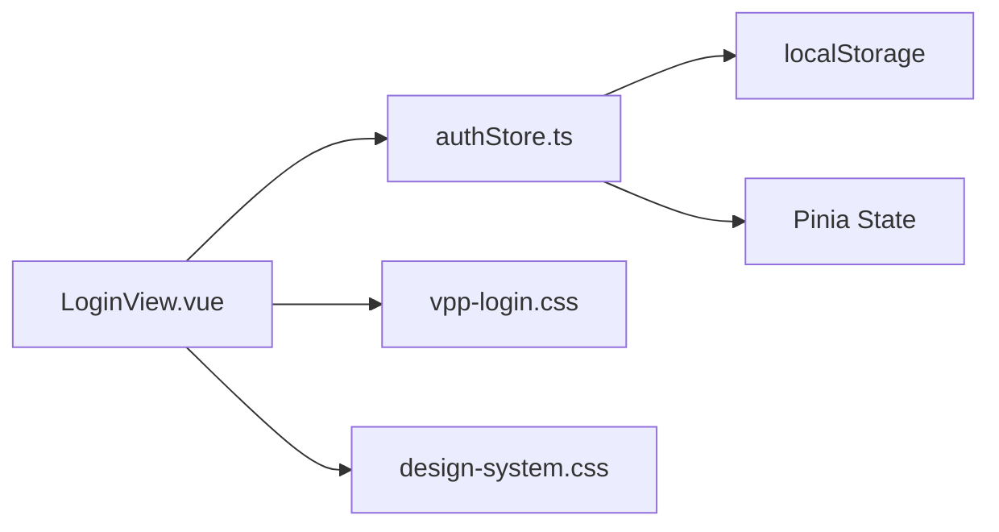

# 需求：AU-03储能系统Vue3重构-阶段0脚手架与登录页

## 背景
澳洲储能系统从纯HTML/JS重构为Vue3+TS架构，阶段0建立独立环境并重构登录页，为后续32个页面迁移打基础。

## 修改清单
- 新建：/root/projects/aus-energy-vue3/ (完整Vue3工程)
- 修改：vite.config.ts (配置base: '/v3/')  
- 新建：src/stores/authStore.ts (Pinia状态管理)
- 新建：src/views/LoginView.vue (登录页组件)
- 引入：vpp-login.css + design-system.css (样式保护)
- 输出：Mermaid依赖关系图 (架构审查)

## 具体操作

### Step 1: 隔离建站与基础配置
```bash
cd /root/projects/
npm create vue@latest aus-energy-vue3 -- --typescript --router --pinia
cd aus-energy-vue3
```

修改vite.config.ts：
```typescript
import { defineConfig } from 'vite'
import vue from '@vitejs/plugin-vue'

export default defineConfig({
  plugins: [vue()],
  base: '/v3/',
  build: {
    outDir: 'dist'
  }
})
```

创建严格模块目录：
```bash
mkdir -p src/core src/stores src/views
```

### Step 2: 状态平滑继承
创建src/stores/authStore.ts：
```typescript
import { defineStore } from 'pinia'

export const useAuthStore = defineStore('auth', {
  state: () => ({
    currentUser: null as any, // 与localStorage.currentUser一致
    role: null as string | null, // 与localStorage.role一致
    isLoggedIn: false
  }),
  
  actions: {
    initFromLocalStorage() {
      const user = localStorage.getItem('currentUser')
      const role = localStorage.getItem('role')
      if (user) {
        this.currentUser = JSON.parse(user)
        this.role = role
        this.isLoggedIn = true
      }
    },
    
    login(userData: any, userRole: string) {
      this.currentUser = userData
      this.role = userRole
      this.isLoggedIn = true
      // 同步到localStorage保持兼容
      localStorage.setItem('currentUser', JSON.stringify(userData))
      localStorage.setItem('role', userRole)
    },
    
    logout() {
      this.currentUser = null
      this.role = null
      this.isLoggedIn = false
      localStorage.removeItem('currentUser')
      localStorage.removeItem('role')
    }
  }
})
```

### Step 3: 样式保护与登录页重构
1. 复制现有样式文件到src/assets/：
   - vpp-login.css
   - design-system.css

2. 创建src/views/LoginView.vue：
   - 解析原vpp-login.html结构
   - 保持100%视觉还原
   - 使用authStore管理登录状态
   - 绝对禁止引入Element Plus

### Step 4: 强制架构审查 (Mermaid)
完成代码后输出依赖关系图：


## 验证方法
1. 执行本地启动命令：`npm run dev`
2. 访问登录页面，确认视觉100%还原
3. 测试登录功能，确认localStorage数据正常
4. 检查vite.config.ts的base配置
5. 审查Mermaid依赖图的架构合理性

## 技术约束
- 开发环境：/root/projects/aus-energy-vue3/
- 部署路径：base: '/v3/'
- 状态管理：Pinia字段名与localStorage键名100%一致
- 样式策略：复用现有CSS，禁用Element Plus
- 架构要求：强制输出Mermaid依赖图

## 时间限制
1小时内完成，超时触发手动接管备案。

## 停顿机制
完成4步后立即停止，输出：
1. vite.config.ts核心配置
2. Mermaid依赖图
3. 本地启动预览命令
4. 项目目录结构

等待架构验收通过后进入下一阶段。